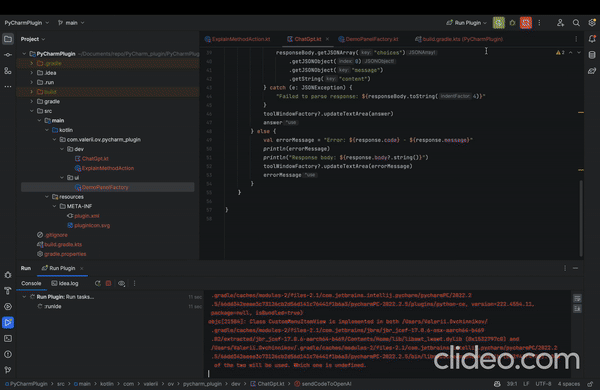

# PyCharm_plugin
---
This is my plugin which allows you to get detailed explanatation of any method / function in your python project.

# How to install

1) clone the repository
2) insert your OpenAi key in `ExplainMethodAction` file
3) Run the plugin

